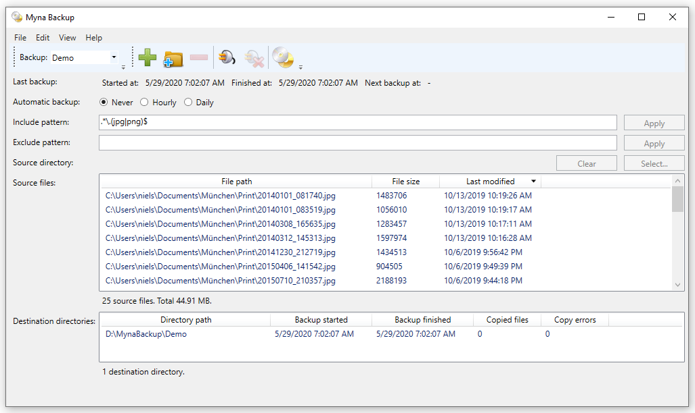
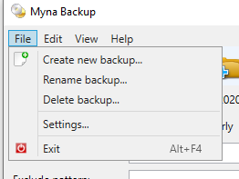
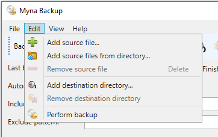
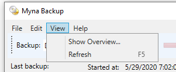
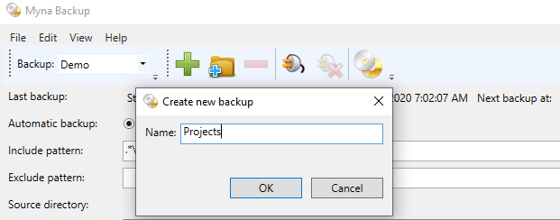
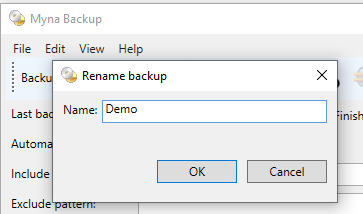
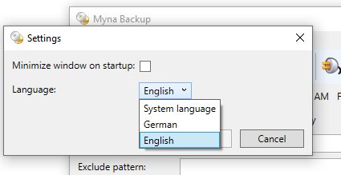
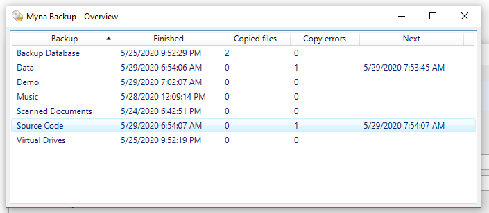
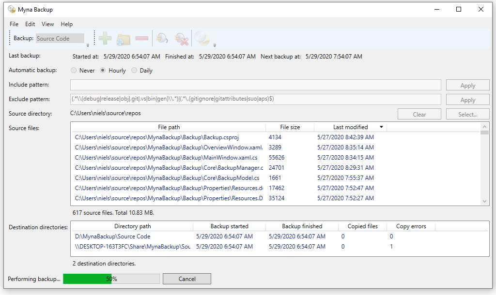
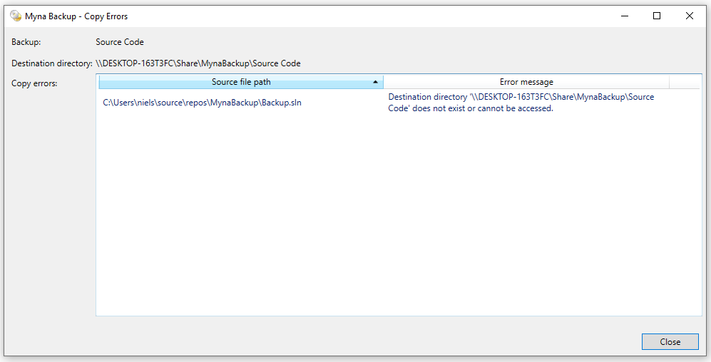

# Myna Backup

## Overview

An application to backup files for Windows using WPF.

## Installation

The program requires .NET 8.

## Features

* Backup of single file collections or directories into multiple destination directories
* Keeps history of changed files in destination directories, see .history subdirectory.
* Include and explude patterns to filter source files
* Automatic backup hourly or daily
* Copies a file only if the content hash of the source file has changed
* Tracks changes if the backup is based on a source file directory, e.g. if files are added or removed
* Supports languages German and English
* Uses a single SQLite database file to store configuration, status and progress for all backups.

## Usage

### Type of Backup

#### Source Directory

For a backup based on a source directory used the Select button to set the source directory. The Clear button will
remove all source files and empties the source directory.

For this backup type no source files can be added or removed interactively.
Any changes to the source directory will be tracked: if a file is removed or added to the directory
or subdirectory the collection will be updated.
The user interface is updated if the collection is refreshed or a backup is performed.

#### Individual File Collection

If the source directory is empty, individual files can be added or removed to the collection.
For individual files use the toolbar buttons to add single files or to add files from a directory.
For this backup type the source files in the collection can be removed or added using
context menus, toolbar buttons or edit menu items.

### Include and Exclude patterns

The collection of source files will be filtered if an include and/or exclude pattern is specified.
For the pattern syntax, see https://docs.microsoft.com/en-us/dotnet/standard/base-types/regular-expression-language-quick-reference.
For example, to include only files with suffix jpg or png (pattern is case insensitve), you can use
the include pattern ".\*\\.(jpg|png)$".
To exclude e.g. a directory path with the name "log", you can use the exclude pattern ".\*\\\\log\\\\.\*".

### Cancel a Backup

If a backup is performed, the Cancel button is enabled. All other interactions are disabled, also the
window cannot be closed during backup. Use the Cancel button instead.

### Copy Errors

Double click on a destination directory to see the copy errors.

## Screenshots

### Menu Items

#### File Menu Item

#### Edit Menu Item

#### View Menu Item

### Create New Backup

### Rename Backup

### Settings

### Overview

### Perform Backup

### Copy Errors

## Licenses

The following icons are used from the Open Icon Library (https://sourceforge.net/projects/openiconlibrary):

application-exit-5.png / nuovext2 / LGPL-2.1 
document-new-6.ico / oxygen / CC-BY-SA 3.0 or LGPL 
document-properties-2.png / gnome / GPLv2 
folder-new-2.ico / echo / CC-BY-SA-3.0 
list-add-4.ico / oxygen / CC-BY-SA 3.0 or LGPL 
list-remove-4.ico / oxygen / CC-BY-SA 3.0 or LGPL 
media-optical-copy-2.ico / oxygen / CC-BY-SA 3.0 or LGPL 
network-connect-2.ico / nuvola / LGPL-2.1 
network-disconnect-2.ico / nuvola / LGPL-2.1 
